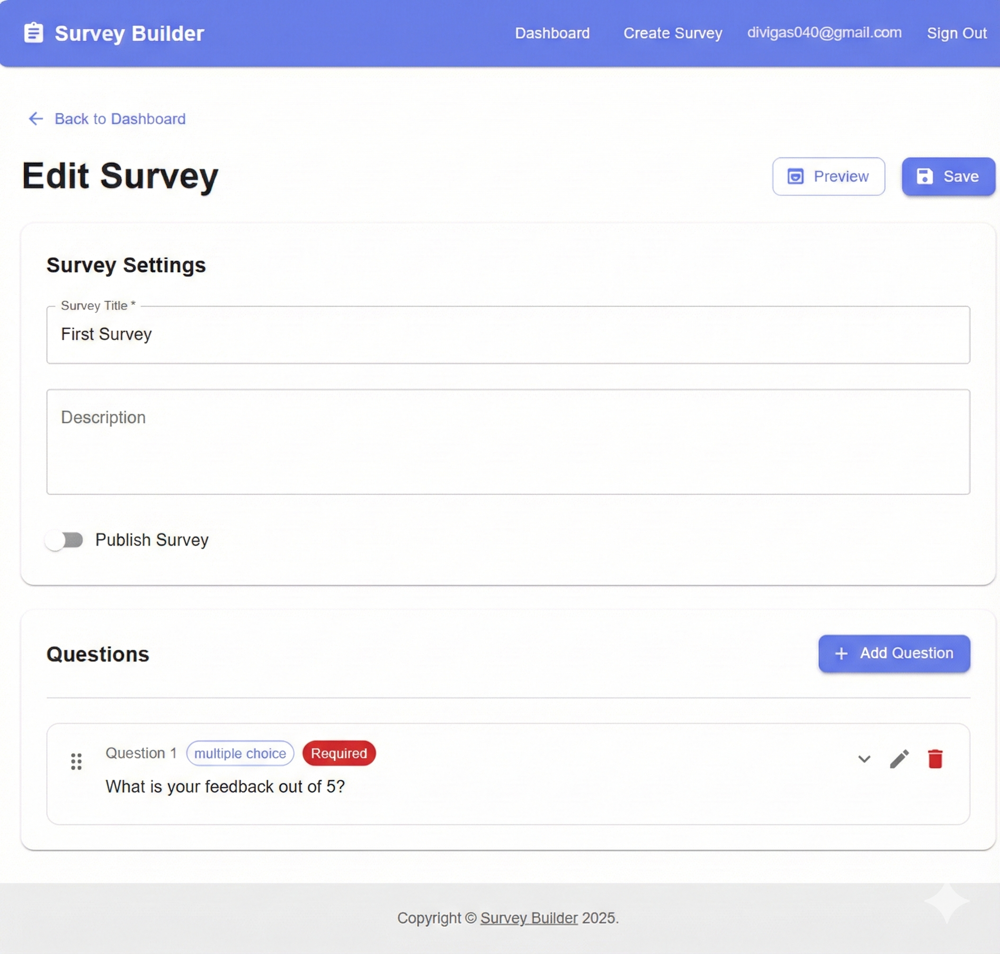
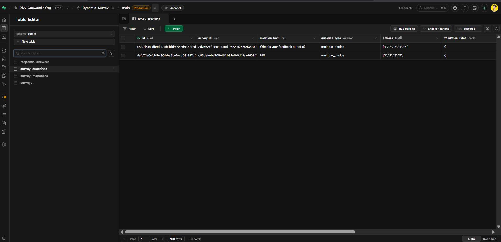
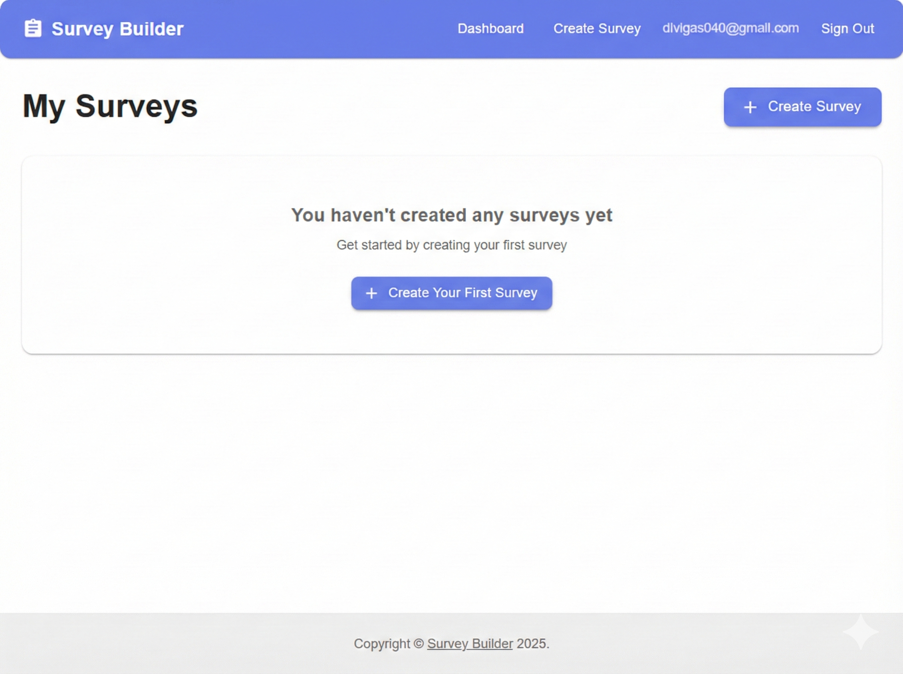

# Dynamic Survey Builder

A comprehensive full-stack survey creation and management system that addresses all major limitations of Google Forms. Built with React, TypeScript, Material UI, and Supabase.



## 🚀 Features

### Core Question Types
- ✅ **Text Input** - Single and multi-line text responses
- ✅ **Multiple Choice** - Radio button selections
- ✅ **Checkbox** - Multi-select options
- ✅ **Dropdown** - Select from dropdown menu
- ✅ **Rating** - Star rating system
- ✅ **Ranking** - Drag-and-drop ranking questions ⭐
- ✅ **Matrix/Grid** - Row and column matrix questions ⭐
- ✅ **File Upload** - Configurable file uploads with size limits ⭐
- ✅ **Date Picker** - Date selection
- ✅ **Time Picker** - Time selection

### Advanced Features (Beyond Google Forms)

#### 1. **Conditional Logic & Skip Logic** ⭐
- Show/hide questions based on previous answers
- Skip to specific questions
- Multiple condition types (equals, contains, greater than, etc.)
- Visual conditional logic editor

#### 2. **Advanced Validation** ⭐
- Min/max length validation
- Pattern matching (regex)
- Email and URL validation
- Custom validation messages
- Numeric range validation

#### 3. **Randomization** ⭐
- Randomize question order
- Randomize option order
- Configurable per survey

#### 4. **Progress Saving** ⭐
- Save survey progress locally
- Resume from where you left off
- Automatic progress persistence

#### 5. **Scoring & Quiz Mode** ⭐
- Quiz mode with scoring
- Per-question point values
- Passing score thresholds
- Score display to respondents
- Automatic score calculation

#### 6. **Advanced Theme Customization** ⭐
- Custom primary/secondary colors
- Custom background color
- Custom font family
- Logo upload support

#### 7. **File Upload Configuration** ⭐
- Configurable max file size (not fixed at 10MB)
- Configurable max number of files
- Allowed file types configuration
- Better file management

#### 8. **Multi-Language Support** ⭐
- Translation system infrastructure
- Support for 6 languages (English, Spanish, French, German, Chinese, Japanese)
- Language selector component
- Language persistence

#### 9. **Advanced Export Options** ⭐
- CSV export
- JSON export
- Excel export (Excel-compatible format)
- Comprehensive data export

#### 10. **Survey Templates** ⭐
- 6 pre-built templates:
  - Customer Satisfaction Survey
  - Employee Feedback Survey
  - Event Feedback Form
  - Product Feedback Survey
  - Quiz Template
  - Market Research Survey
- One-click template application

#### 11. **Webhook Support** ⭐
- Real-time webhook notifications
- Configurable webhook URLs
- Event-based triggers (response.started, response.completed, response.updated)
- Automatic webhook firing

#### 12. **A/B Testing Infrastructure** ⭐
- A/B testing utilities
- Variant assignment
- Event tracking
- Results calculation

#### 13. **Advanced Analytics**
- Question-by-question analytics
- Ranking question analytics (average positions)
- Matrix question support
- Visual charts and graphs
- Response distribution analysis

## 📋 Prerequisites

- **Node.js** 18+ ([Download](https://nodejs.org/))
- **pnpm** package manager ([Installation Guide](https://pnpm.io/installation))
- **Supabase Account** ([Sign up](https://supabase.com/))

## 🛠️ Installation

### 1. Clone the Repository

```bash
git clone https://github.com/Divy-Goswami/Dynamic_Survey.git
cd Dynamic_Survey
```

### 2. Set Up Supabase

1. Create a new project on [Supabase](https://supabase.com/)
2. Run the database migrations from `supabase/supabase/tables/`:
   - `surveys.sql`
   - `survey_questions.sql`
   - `survey_responses.sql`
   - `response_answers.sql`
3. Apply RLS policies from `supabase/supabase/migrations/`
4. Deploy Edge Functions from `supabase/supabase/functions/`:
   - `submit-response`
   - `get-analytics`
   - `export-responses`

### 3. Configure Environment Variables

Navigate to the survey-builder directory:

```bash
cd survey-builder/survey-builder
```

Copy the example environment file:

```bash
cp .env.example .env
```

Edit `.env` and add your Supabase credentials:

```env
VITE_SUPABASE_URL=your_supabase_url
VITE_SUPABASE_ANON_KEY=your_supabase_anon_key
```

### 4. Install Dependencies

```bash
pnpm install
```

## 🚀 Running the Project

### Option 1: Using PowerShell Script (Windows)

```powershell
.\run-project.ps1
```

### Option 2: Manual Start

```bash
cd survey-builder/survey-builder
pnpm dev
```

The development server will start at `http://localhost:5173`

## 📁 Project Structure

```
Dynamic_Survey/
├── survey-builder/
│   └── survey-builder/          # Frontend React application
│       ├── src/
│       │   ├── components/      # React components
│       │   ├── pages/           # Page components
│       │   ├── hooks/           # Custom React hooks
│       │   ├── utils/           # Utility functions
│       │   ├── data/            # Data files (templates)
│       │   └── i18n/            # Translation files
│       ├── public/              # Static assets
│       └── package.json
├── supabase/
│   └── supabase/
│       ├── functions/           # Supabase Edge Functions
│       ├── tables/              # Database table schemas
│       └── migrations/          # Database migrations
├── Scrennshots/                 # Project screenshots
└── README.md                    # This file
```

## 🎯 Usage Guide

### Creating a Survey

1. **Sign up/Login** - Create an account or login
2. **Create Survey** - Click "Create Survey" or use a template
3. **Add Questions** - Add questions with various types
4. **Configure Settings** - Use "Advanced Settings" for:
   - Theme customization
   - Randomization
   - Progress saving
   - File limits
   - Scoring/Quiz mode
   - Multi-language
   - Webhooks
5. **Publish** - Toggle publish to make survey public

### Using Templates

1. Go to Dashboard
2. Click "Use Template"
3. Select a template
4. Survey is created with all questions pre-filled

### Setting Up Conditional Logic

1. Edit a survey
2. Add/edit a question
3. Configure conditional logic rules
4. Set conditions based on previous questions

### Configuring Webhooks

1. Edit a survey
2. Click "Advanced Settings"
3. Go to "Webhooks" tab
4. Enter webhook URL
5. Select events to trigger

### Exporting Data

1. Go to Analytics page
2. Click export buttons (CSV/JSON/Excel)
3. Download comprehensive survey data

## 🗄️ Database Schema

### Tables

- **surveys** - Survey metadata and settings
- **survey_questions** - Individual questions with types and options
- **survey_responses** - Response sessions
- **response_answers** - Individual answers (flexible JSON storage)

### Edge Functions

- **submit-response** - Handles survey response submission with webhook support
- **get-analytics** - Aggregates analytics data
- **export-responses** - Exports data as CSV/JSON

## 🎨 Tech Stack

### Frontend
- **React 18** - UI library
- **TypeScript** - Type safety
- **Material UI (MUI)** - Component library
- **React Router** - Routing
- **Recharts** - Data visualization
- **React Hook Form** - Form management
- **@dnd-kit** - Drag and drop functionality
- **Vite** - Build tool

### Backend
- **Supabase** - Backend as a Service
  - PostgreSQL database
  - Authentication
  - Edge Functions
  - Row Level Security (RLS)

## 📸 Screenshots






## 🔒 Security

- Row Level Security (RLS) enabled on all tables
- User authentication required for survey creation
- Public access only to published surveys
- Survey owners can only access their own data
- Edge functions validate user permissions

## 📝 Features Comparison with Google Forms

| Feature | Google Forms | Dynamic Survey Builder |
|---------|-------------|------------------------|
| Ranking Questions | ❌ | ✅ |
| Matrix Questions | ❌ | ✅ |
| Conditional Logic | ⚠️ Basic | ✅ Advanced |
| File Upload Limits | ⚠️ Fixed | ✅ Configurable |
| Progress Saving | ❌ | ✅ |
| Quiz/Scoring | ⚠️ Basic | ✅ Advanced |
| Theme Customization | ⚠️ Limited | ✅ Full Control |
| Multi-Language | ❌ | ✅ |
| Export Options | ⚠️ CSV/Sheets | ✅ CSV/JSON/Excel |
| Templates | ❌ | ✅ |
| Webhooks | ❌ | ✅ |
| A/B Testing | ❌ | ✅ |
| Randomization | ❌ | ✅ |
| Advanced Validation | ⚠️ Basic | ✅ Advanced |

## 🤝 Contributing

Contributions are welcome! Please feel free to submit a Pull Request.

## 📄 License

MIT License

## 👤 Author

**Divy Goswami**

- GitHub: [@Divy-Goswami](https://github.com/Divy-Goswami)

## 🙏 Acknowledgments

- Built with [Supabase](https://supabase.com/)
- UI components from [Material UI](https://mui.com/)
- Icons from [Material Icons](https://fonts.google.com/icons)

## 📚 Documentation

For detailed feature documentation, see [FEATURES_IMPLEMENTED.md](survey-builder/survey-builder/FEATURES_IMPLEMENTED.md)

## 🐛 Known Issues

- Offline mode support is pending (requires service worker implementation)

## 🔮 Future Enhancements

- Offline mode with service workers
- Real-time collaboration
- Advanced A/B testing UI
- More survey templates
- Extended translation coverage
- Payment integration
- Signature collection

---

⭐ = Feature that addresses Google Forms limitations

